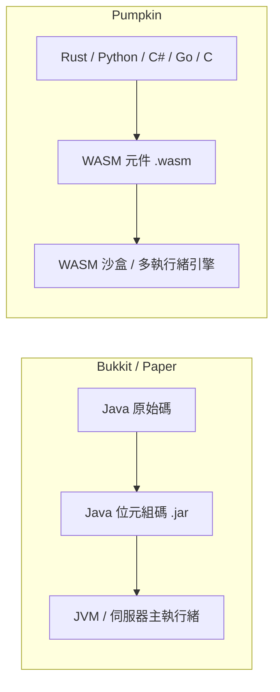

# 遷移總覽與架構

從 Bukkit / Spigot / Paper 的外掛開發轉移至 Pumpkin，意味著要從以 Java 為中心的物件導向模型，轉換為編譯式、多語言的 WebAssembly (WASM) 元件模型。

## 高階架構差異

| 概念 | Bukkit / Spigot / Paper | Pumpkin |
| --- | --- | --- |
| 語言支援 | Java / Kotlin / Scala (JVM) | Rust、Python、Kotlin、C#、Go、C |
| 二進位輸出 | `.jar` Java 封存檔 | `.wasm` WebAssembly 元件 |
| 外掛描述檔 | `plugin.yml` 檔案 | 程式化 `PluginMetadata` 結構 |
| 生命週期掛鉤 | `onEnable()` / `onDisable()` | `on_load(context)` / `on_unload(context)` |
| 安全性與隔離 | 無限制的 JVM 反射 (Reflection) | 沙盒化 WASM 能力模型 (Capability model) |
| 並行處理 | 單執行緒 tick 迴圈 (`BukkitScheduler`) | 搭配非同步執行階段的多執行緒原生執行 |

## 詳細遷移主題

請探索以下針對各主要外掛子系統的專屬遷移指南：

- [遷移指令](./commands) — 從 `getCommand().setExecutor()` 與 `plugin.yml` 轉換至 Brigadier 指令樹。
- [遷移事件](./events) — 將 `@EventHandler` 與 `Listener` 介面替換為 Pumpkin 的阻塞與非阻塞事件系統。
- [遷移物品欄](./inventories)[與 GUI](./inventories) — 從 `Bukkit.createInventory()` 轉移至 Pumpkin 的容器與視窗處理器。
- [遷移設定](./configuration)[與資料](./configuration) — 將 `getConfig()` / `config.yml` 替換為原生 TOML、JSON 或自訂儲存方式。